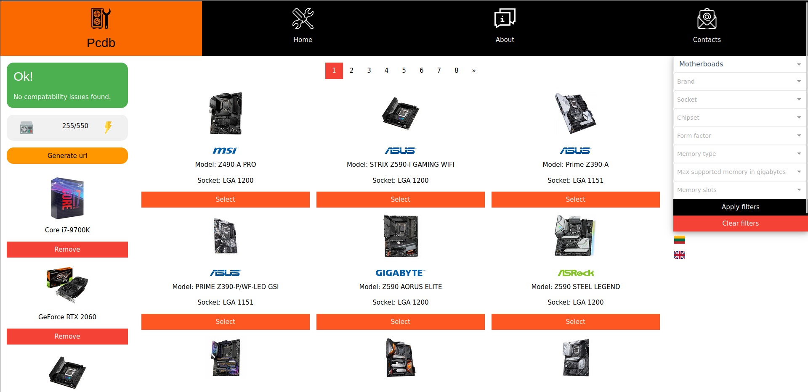

# pcdb.ngrok.io
### Requirements
```
docker
docker-compose
```
### Screenshot


### Full usage example

1. Create server docker image
```
cd server
docker build -t pcbuilder_server .
```

2. Create client docker image
```
cd ../client
docker build -t pcbuilder_client .
```

3. From root directory start server, client and database
```
docker-compose up -d
```

4. Load database dump
```
docker cp pcdb_test.tar pcbuilder_db:/pcdb_test.tar
docker exec -i pcbuilder_db pg_restore -U testuser -v -d pcdb_test pcdb_test.tar
```

5. Open localhost:8081